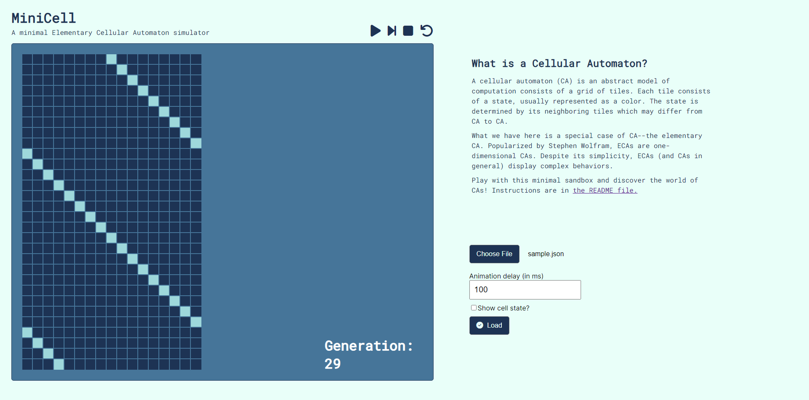

# MiniCell
MiniCell is a minimal interface for an ECA simulator.

Since MiniCell is designed to be a minimal interface, we simply use vanilla HTML,
CSS and JavaScript for the application. Thus, anyone with the source code can 
simply run in their browser by clicking `index.html` as the entry point. 
**No installations or library management required!**

The application is also available at https://minicell.netlify.app/.

# Usage

1.  Run the `index.html` file in your browser or go to https://minicell.netlify.app/.
2.  Click 'Choose File' and uplaod the JSON file pertaining to the particular ECA.
    The JSON file should follow the format specified below.
3.  Set the animation delay and choose whether or not to display state labels.
4.  Click 'Load' for the application to read the JSON file.
5.  You can choose to play forward, pause, step one generation, stop or reset. 
    The stop will simply restart the animation while the reset button will clear 
    everything including the machine and the canvas. You can also trace the 
    current generation.

## Input File Format

The file is simply in JSON format with two main properties--definition and display.

### Machine Definiton

The definition property contains the specified ECA model. Specifically, it 
contains the list of states, the ruleset and the initial configuration.

**State labels should only be one character.** This is to simplify the parsing 
process.

The ruleset is an object that maps each neighborhood to the updated state of the 
middle cell. **Should there exists no ruleset for a configuration, the 
neighborhood simply copies itself to the next generation.**

The initial configuration should consist of the symbols in the list of states.

### Machine Display

The display property contains information on marking up the ECA. It includes 
the color assignment for each state. **Each state listed in the machine definition
should have an assigned color by making them the key-value pair respectively.**

The value of the state is directly plugged into the styles of the cell. Thus, 
**hex code**, **rgba() values** or **simple color names** in HTML (blue, red, ...)
are supported.


#### Example
The following is a ECA that everything to the right in every time step.

```JSON
    {
        "definition": {
            "states": ["0", "1"],
            "ruleset": {
                "000": "0",
                "001": "0",
                "010": "0",
                "011": "0",
                "100": "1",
                "101": "1",
                "110": "0",
                "111": "1"
            },
            "initialConfig": "00000000100000000"
        },
        "display": {
            "states": {
                "0": "#1D3354",
                "1": "#9ED8DB"
            }
        }
    }
```

The previous machine results to the following output for the first 
30 generations:
.
